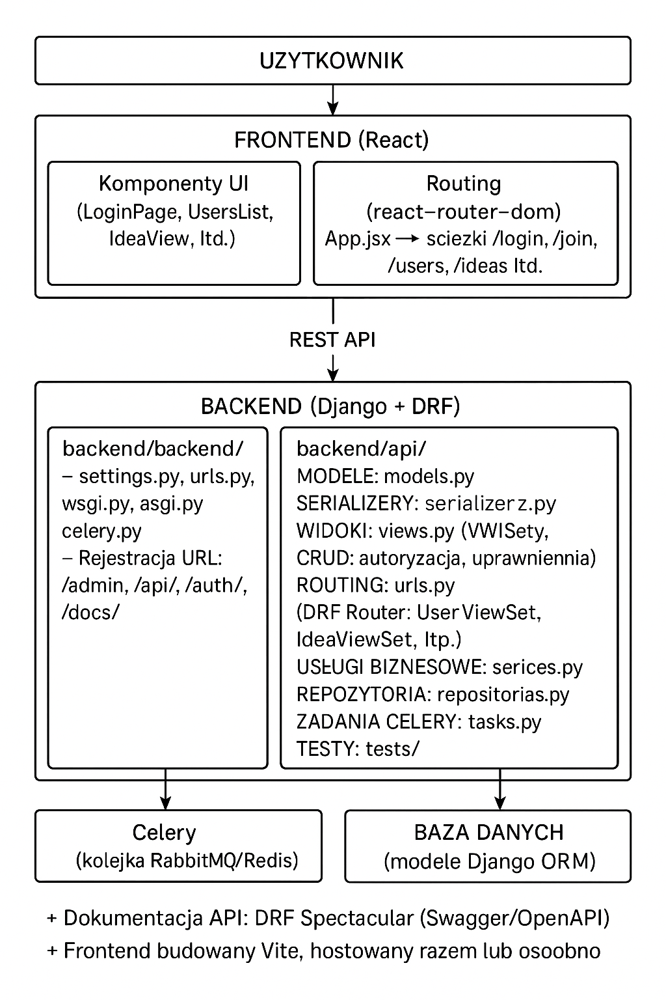

# InspiArt

InspiArt to aplikacja webowa dedykowana artystom, zarówno profesjonalnym, jak i początkującym. Jej głównym celem jest eliminacja problemu artblocka (braku inspiracji), który jest powszechnym zjawiskiem wśród artystów. Aplikacja generuje losowe pomysły, które mają pomóc użytkownikom w tworzeniu rysunków i ilustracji.


## Opis projektu

Aplikacja oferuje:

- Generatory pomysłów dostosowane do preferencji użytkownika,
- Galerię do przechowywania i porządkowania twórczości,
- Możliwość zapisania swoich ulubionych pomysłów.

W odróżnieniu od innych narzędzi dostępnych na rynku, InspiArt łączy intuicyjny interfejs z funkcjonalnościami dedykowanymi zarówno amatorom, jak i profesjonalistom. Aplikacja umożliwia nie tylko szybkie znalezienie inspiracji, ale również zachowanie ciągłości twórczej poprzez integrację galerii użytkownika z generatorem pomysłów.

InspiArt doskonale sprawdzi się w przypadku:

- Braku motywacji do tworzenia,
- Trudności w rozpoczęciu nowego, niecodziennego projektu artystycznego,
- Poszukiwania wyzwań i kreatywnych inspiracji.


## Instrukcja uruchomienia

### Backend

Aby uruchomić backend, przejdź do folderu backend i tam wykonaj polecenie:

```
python manage.py runserver
```

### Frontend

Aby uruchomić frontend, przejdź do folderu frontend i tam wykonaj polecenie:

```
npm run dev
```

## Technologie użyte w projekcie

- **Django** – framework backendowy, wybrany ze względu na szybkie tworzenie aplikacji webowych oraz bogaty ekosystem.
- **Django REST Framework** – do budowy API REST, umożliwiający łatwe tworzenie i testowanie endpointów.
- **Celery z RabbitMQ** – do obsługi asynchronicznych zadań, co pozwala na odciążenie głównego wątku aplikacji i lepszą skalowalność.
- **PostgreSQL** – relacyjna baza danych, stabilna i wydajna, dobrze integrująca się z Django.
- **drf_spectacular** – do automatycznego generowania dokumentacji API w formacie OpenAPI/Swagger.
- **dj_rest_auth** – do zarządzania uwierzytelnianiem i rejestracją użytkowników.
- **React** – frontendowa biblioteka do budowy interfejsu użytkownika, wybrana ze względu na komponentową architekturę i dużą społeczność.
- **Vite** – narzędzie do szybkiego budowania i serwowania aplikacji frontendowej.
- **CORSheaders** – do obsługi polityki CORS, umożliwiającej komunikację między frontendem a backendem na różnych domenach.
- **SMTP (Gmail)** – do wysyłania maili z aplikacji, np. powitalnych wiadomości.


## Architektura projektu

| Warstwa         | Technologia               | Funkcja                                                      |
|-----------------|--------------------------|-------------------------------------------------------------|
| Frontend        | React + Vite             | UI, routing, komunikacja z backendem, tokeny w localStorage |
| Backend         | Django + DRF             | Logika biznesowa, REST API, autoryzacja, zarządzanie danymi |
| Asynchroniczność| Celery + Redis/RabbitMQ  | Przetwarzanie zadań w tle, np. wysyłka e-maili              |
| Baza danych     | Django ORM + (PostgreSQL?)| Przechowywanie danych użytkowników, pomysłów itd.            |
| Autoryzacja     | dj-rest-auth + JWT/sesje | Logowanie, rejestracja, zarządzanie sesją                    |
| Dokumentacja    | drf-spectacular          | Automatyczne generowanie OpenAPI/Swagger                     |


